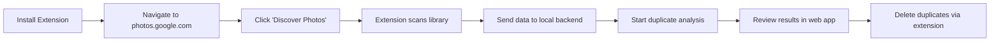

# Google Photos Deduper

> ⚠️ **NEW: Migration Required for March 31, 2025 API Changes**  
> Google Photos API has removed scopes that allowed reading entire libraries. This tool now uses an **enhanced Chrome Extension** to discover photos directly from the Google Photos web interface. See [MIGRATION_GUIDE.md](./MIGRATION_GUIDE.md) for details.

A locally run web app and Chrome extension to find and remove duplicate photos from Google Photos.

[](https://www.youtube.com/watch?v=YOUR_VIDEO)
[](chrome_extension/)
[](https://opensource.org/licenses/MIT)

## ✨ Features

- 🎯 **Accurate Duplicate Detection** - Uses advanced ML image embeddings (MediaPipe + MobileNet V3)
- 🚀 **Fast Processing** - Optimized for large libraries with chunked processing
- 🎨 **Beautiful Modern UI** - Google Photos-inspired design with rich metrics
- 🔒 **100% Local & Private** - All processing happens on your machine
- 🌐 **Chrome Extension** - Seamlessly discovers and deletes photos via web interface
- 📊 **Rich Progress Tracking** - Real-time metrics, ETAs, and visual feedback
- 🎭 **Interactive Results** - Side-by-side comparison with similarity percentages

## 🚨 Important: API Changes (March 31, 2025)

Google has removed the following scopes from the Photos Library API:
- ❌ `photoslibrary.readonly` - Can no longer read entire library
- ❌ `photoslibrary` - Full access scope removed
- ❌ `photoslibrary.sharing` - Sharing functionality removed

**Solution:** This app now uses an **Enhanced Chrome Extension** that:
- Discovers photos directly from Google Photos web interface
- No API limitations - can access your entire library
- More reliable and user-controlled
- Handles both discovery AND deletion

See [MIGRATION_GUIDE.md](./MIGRATION_GUIDE.md) for complete details.

## 🎬 How It Works

### New Extension-Based Workflow



### Technical Overview

1. **Photo Discovery** (Chrome Extension)
   - Scrolls through Google Photos web interface
   - Extracts photo metadata from DOM
   - Sends batches to local backend

2. **Duplicate Detection** (Python Backend)
   - Downloads images for analysis
   - Generates image embeddings using ML models
   - Calculates similarity using cosine distance
   - Groups duplicates using community detection

3. **Review & Delete** (Web App + Extension)
   - Beautiful UI shows duplicate groups
   - Side-by-side comparison
   - Extension handles deletion via web interface

## 🚀 Quick Start

### Prerequisites

- **Docker** & **Docker Compose**
- **Chrome Browser** (for extension)
- **Google Account** with Google Photos

### Installation

1. **Clone the repository**
   ```bash
   git clone https://github.com/mahreencodes/google-photos-deduper.git
   cd google-photos-deduper
   ```

2. **Set up Google Cloud Project**
   
   See [MIGRATION_GUIDE.md](./MIGRATION_GUIDE.md#google-cloud-console-configuration) for detailed steps.
   
   Quick summary:
   - Create project at [Google Cloud Console](https://console.cloud.google.com/)
   - Enable "Google Photos Library API" (for user info only)
   - Create OAuth 2.0 credentials
   - Download as `client_secret.json` in project root
   - Update OAuth consent screen (remove deprecated scopes)

3. **Configure environment**
   ```bash
   cp example.env .env
   # Edit .env and add your configuration
   ```

4. **Start the application**
   ```bash
   docker-compose up --build
   ```

5. **Build Chrome Extension**
   ```bash
   docker compose -f chrome_extension/docker-compose.yml run node npm run build
   ```

6. **Load Extension in Chrome**
   - Navigate to `chrome://extensions/`
   - Enable "Developer mode"
   - Click "Load unpacked"
   - Select `chrome_extension/dist` directory

7. **Access the web app**
   - Open http://localhost:3000
   - Log in with your Google account

## 📖 Usage Guide

### Step 1: Discover Photos

1. Navigate to https://photos.google.com in Chrome
2. Click the extension icon (📸) in your browser toolbar
3. Click "Discover Photos" button
4. Wait while extension scans your library (progress shown in popup)
5. Click "Send to Backend" once discovery is complete

### Step 2: Start Analysis

1. Click "Start Analysis" in the extension popup
2. Or go to the web app and use the "Process Duplicates" page
3. Configure options:
   - **Resolution** (224px recommended for speed)
   - **Similarity Threshold** (0.9 = 90% similar)
   - **Chunk Size** (1000 photos per batch)
   - **Image Storage Path** (where to store downloaded images)

### Step 3: Monitor Progress

The beautiful web interface shows:
- 📸 Photos loaded from extension
- 🔍 Photos being analyzed
- ⏱️ Elapsed time and ETA
- 📊 Processing speed
- 🎯 Duplicates found

### Step 4: Review Results

- See duplicate groups with similarity percentages
- Side-by-side photo comparison
- File size and dimensions
- Original vs duplicate indicators

### Step 5: Delete Duplicates

1. Select duplicates you want to remove
2. Click "Delete Selected"
3. Extension automatically handles deletion via Google Photos web interface

## 🎨 UI Highlights

- **Google Photos Color Palette** - Authentic look and feel
- **Animated Progress Cards** - Real-time metrics with smooth animations
- **Video Background** - Beautiful looping background
- **Responsive Design** - Works on desktop and mobile
- **Rich Metrics** - Photos gathered, processed, time estimates, processing speed
- **Interactive Gallery** - Recently processed photos with hover effects

## ⚙️ Configuration Options

### Backend Configuration (`.env`)

```bash
# Google OAuth
GOOGLE_CLIENT_ID=your_client_id
GOOGLE_CLIENT_SECRET=your_client_secret

# Database
MONGODB_URI=mongodb://mongo:27017
DATABASE=google_photos_deduper

# Storage
IMAGE_STORE_PATH=/tmp/google-photos-images
PUBLIC_IMAGE_FOLDER=http://localhost:5001/images

# Server
CLIENT_HOST=http://localhost:3000
```

### Analysis Options

- **Resolution**: Image size for analysis (224, 512, 1024)
  - Lower = faster but less accurate
  - Higher = slower but more accurate
  
- **Similarity Threshold**: 0.0-1.0 (default: 0.9)
  - Higher = only very similar photos
  - Lower = more loose matching
  
- **Chunk Size**: Photos per batch (default: 1000)
  - Affects memory usage
  - Adjust based on available RAM

## 🔧 Development

### Project Structure

```
google-photos-deduper/
├── app/                    # Python backend (Flask + Celery)
│   ├── lib/               # Core logic (duplicate detection)
│   ├── models/            # Database models
│   └── server.py          # API endpoints
├── client/                # React frontend
│   ├── src/
│   │   ├── components/    # UI components
│   │   ├── utils/         # Helpers and context
│   │   └── theme.ts       # Material-UI theme
├── chrome_extension/      # Chrome Extension
│   ├── src/
│   │   ├── scripts/       # Content scripts
│   │   ├── popup.ts       # Extension popup
│   │   └── types.ts       # TypeScript types
│   └── src_manifest.json  # Extension manifest
└── docs/                  # Documentation
```

### Running Tests

```bash
# Backend tests
docker-compose run --rm server pytest

# Frontend tests
docker-compose run --rm client npm test
```

### Development Mode

```bash
# Backend with hot reload
docker-compose up server worker

# Frontend with hot reload
docker-compose up client

# Extension rebuild
cd chrome_extension
docker compose -f docker-compose.yml run node npm run build
```

## 🤝 Contributing

Contributions are welcome! Please:

1. Fork the repository
2. Create a feature branch
3. Make your changes
4. Add tests if applicable
5. Submit a pull request

## 📝 License

This project is licensed under the MIT License - see the [LICENSE](LICENSE) file for details.

## 🙏 Acknowledgments

- Original project by [mtalcott](https://github.com/mtalcott/google-photos-deduper)
- MediaPipe for image embedding models
- Google Photos API documentation
- Material-UI for React components

## 📚 Additional Documentation

- [MIGRATION_GUIDE.md](./MIGRATION_GUIDE.md) - API migration details
- [DEDUP-WORKFLOW.md](./docs/DEDUP-WORKFLOW.md) - Technical workflow explanation
- [DEVELOPMENT.md](./docs/DEVELOPMENT.md) - Development setup

## ⭐ Star History

If you find this project useful, please give it a star! ⭐

## 📞 Support

- **Issues**: [GitHub Issues](https://github.com/mahreencodes/google-photos-deduper/issues)
- **Discussions**: [GitHub Discussions](https://github.com/mahreencodes/google-photos-deduper/discussions)

## 🔮 Roadmap

- [ ] Google Photos Picker API integration (alternative to extension)
- [ ] Video duplicate detection
- [ ] Advanced filters (date range, album, etc.)
- [ ] Bulk editing features
- [ ] Export duplicate reports
- [ ] Mobile app support

---

**Made with ❤️ for the Google Photos community**

**Note:** This tool is not affiliated with or endorsed by Google. Use at your own risk.
